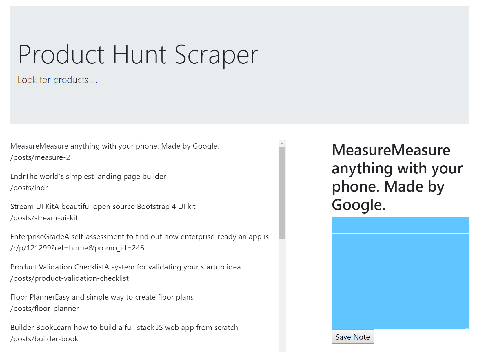

# Product Hunt Scraper
Scrape cool products from producthunt.com and write a note for any products you are interested in!

## Getting Started

Open up the [project link](https://murmuring-hamlet-49489.herokuapp.com/) and add /scrape at the end of the url. Then go back and you should see this:

### Prerequisites

You need to have a modern browser able to handle HTML5, Javascript, and CSS (such as the Google Chrome browser).

### Installing

No installation needed! Just open the page in your preferred browser.

## Built With

* HTML5

* CSS

* [Javascript](https://www.javascript.com/) - The scripting language used

* [BootstrapCDN v4.1.0](https://getbootstrap.com/docs/4.1/getting-started/introduction/) - The web framework used

* [jQuery v3.3.1](http://jquery.com/) - Java library for DOM and CSS manipulation

* [Node.js](https://nodejs.org/en/) - JavaScript runtime

* [Node Package Manager](https://www.npmjs.com/) - Package manager for JavaScript and Node

* [Express](https://www.npmjs.com/package/express) - Server-side framework

* [Body Parser](https://www.npmjs.com/package/cli-table) - Request parsing middleware

* [Mongoose](http://mongoosejs.com/) - MongoDB ODM

* [Cheerio](https://www.npmjs.com/package/cheerio) - Server-side markup parser

## Author

* **Hannah Lim** - [hannahlim213](https://github.com/hannahlim213)

## License

This project is licensed under the MIT License - see the [LICENSE.md](LICENSE.md) file for details
